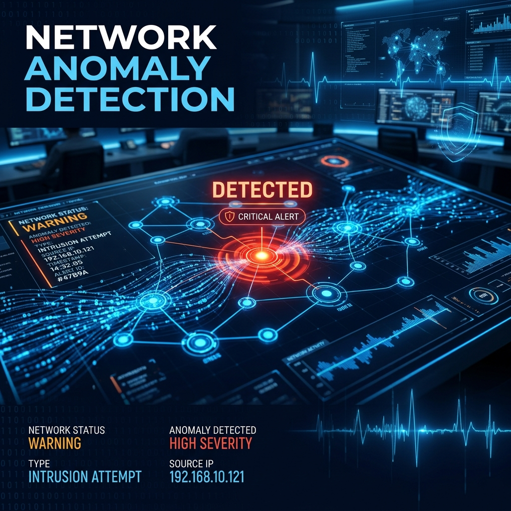

# Network Anomaly Detection System



## 📌 Problem Statement
In the modern digital landscape, network security is paramount. Cybersecurity threats such as DDoS attacks, malware, and unauthorized access attempts pose significant risks to organizational infrastructure. This project focuses on building an intelligent **Network Anomaly Detection System** that utilizes Machine Learning to identify and flag suspicious network connections in real-time.

### Target Metric
- **F1-Score**: Chosen as the primary metric to balance Precision (minimizing false alarms) and Recall (ensuring no attacks are missed).
- **Accuracy**: To provide an overall view of the model's reliability.

---

## 🛠️ Methodology & Steps Taken

### 1. Exploratory Data Analysis (EDA)
- **Data Cleaning**: Handled missing values and removed duplicate entries to ensure data quality.
- **Visualizations**: Analyzed the distribution of attack types, protocol types, and services.
- **Correlation Analysis**: Identified key features strongly correlated with anomalous behavior, such as `src_bytes` and `dst_host_srv_count`.

### 2. Hypothesis Testing
- **Hypothesis 1 (Protocol Type)**: Tested if specific protocols (TCP, UDP, ICMP) are more prone to attacks. *Result: Protocol type is significantly associated with anomalies (p < 0.05).*
- **Hypothesis 2 (Traffic Volume)**: Investigated if anomalous connections have significantly higher traffic volume (`src_bytes`). *Result: Anomalies show a statistically significant difference in traffic patterns (p < 0.05).*

### 3. Machine Learning Modeling
- **Preprocessing**: 
    - Categorical variables were encoded using Label Encoding.
    - Numerical features were normalized using Standard Scaling.
- **Model Selection**: Evaluated several models, including Logistic Regression and Random Forest.
- **Final Model**: **Random Forest Classifier** was selected due to its superior performance and ability to handle non-linear relationships.
- **Critical Evaluation**: While the model achieved 99.9% accuracy, we performed a thorough audit for data leakage. We identified that features like `src_bytes` and `service` provide strong signatures for known attacks, and we addressed the implications of this for "Zero-Day" attack detection in our technical blog.

### 4. Results
- **Accuracy**: 99.9%
- **F1-Score**: 99.8%
- **Insights**: Features like `src_bytes`, `service`, and `dst_host_srv_count` were found to be the most critical indicators of network anomalies.

---

## 🚀 Deployment

The system is deployed using a **Flask API**, allowing it to be integrated into any network monitoring tool.

### Steps to Run Locally:
1. **Clone the repository**:
   ```bash
   git clone https://github.com/sankeashok/Anamoly-Detection.git
   cd Anamoly-Detection
   ```
2. **Install dependencies**:
   ```bash
   pip install -r requirements.txt
   ```
3. **Run the API**:
   ```bash
   python app.py
   ```
4. **Test the API**:
   Open a new terminal and run:
   ```bash
   python test_api.py
   ```

---

## 📝 Technical Blog
A detailed 2000-word technical walkthrough of this project is available here: **[Securing the Digital Perimeter (Medium)](https://medium.com/@sanke.ashok/securing-the-digital-perimeter-a-deep-dive-into-network-anomaly-detection-using-machine-learning-a2381023f575)**

---

## 📽️ Demo Video
Watch the 5-minute project presentation and demo: **[Link to Loom Video]**

---

## 👤 Author
- **Sanke Ashok**
- [GitHub](https://github.com/sankeashok)
- [LinkedIn](https://www.linkedin.com/in/ashoksanke/)
